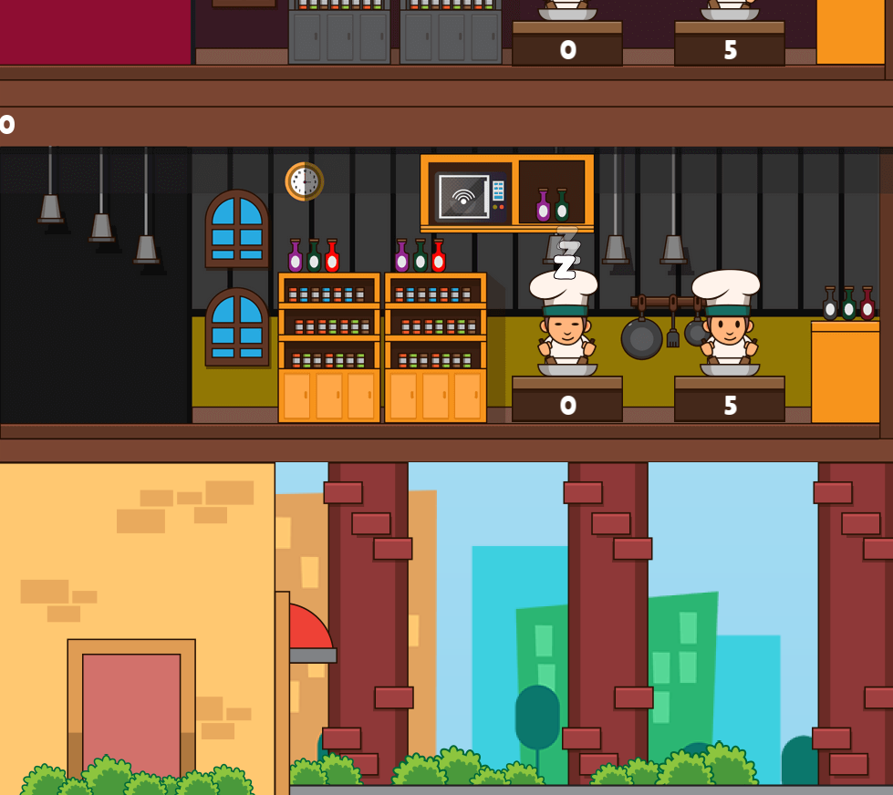

# 🍕 The Plazza

**The Plazza** is a sophisticated **multithreaded simulation** of a pizzeria designed to efficiently manage pizza production at scale. The system implements a **concurrent architecture** utilizing modern C++ design patterns where a centralized `Reception` handles incoming orders and intelligently distributes them across multiple `Kitchen` instances. Each `Kitchen` maintains its own isolated `inventory` of ingredients and employs several `Cook` threads that prepare pizzas concurrently.

## 🔧 Installation & Setup

This project is compiled via `Makefile` with two build options:

- **`make` or `make re`**: Standard compilation for the base simulation
- **`make bonus`**: Enables additional features through conditional compilation (`PLAZZA_BONUS` flag), activating a graphical visualization of the pizzeria

### Prerequisites

- C++17 compatible compiler (GCC/Clang)
- POSIX-compliant system (Linux/macOS)
- Make build system
- pthread library

## 🚀 Basic Usage

Once compiled with `make`, you can launch the project with the binary `./plazza` using three mandatory parameters:

```bash
./plazza <multiplier> <cooks_per_kitchen> <restock_time_ms>
```

**Parameters:**
- `multiplier`: Cooking speed multiplier (floating-point value)
- `cooks_per_kitchen`: Number of cooks per kitchen instance (integer)
- `restock_time_ms`: Time required to restock one unit of every ingredient (milliseconds)

### Example

```bash
./plazza 2.0 4 2000
```

## 🧪 Testing

### Unit Tests

In addition to the two make builds for program execution, we provide a comprehensive testing suite. This can be compiled with:

```bash
make tests_run
```

This option runs **40 comprehensive tests** across our codebase, focusing on:

1. **Parsing**: Command-line input parsing and validation
2. **PizzaFactory**: Pizza creation system derived from our `Singleton` pattern
3. **Singleton**: Implementation validation of the Singleton design pattern

The test suite first verifies the PizzaFactory functionality and available commands, then validates our Singleton implementation by creating a mock class.

### Error Handling Architecture

Our testing methodology extends beyond unit tests. We have developed a **hierarchical error class system**, with the top-level class inheriting from `std::exception`: `Exception`. The classes `InvalidArgument` and `ParsingException` are derived from this `Exception` base class.

### Logging System

We've implemented a comprehensive **logging system** via the `Logger` class. All CLI output is directed to our log file `plazza.log` to maintain a clean CLI during simulation while simultaneously acquiring substantial debugging information.

**Log information includes:**
- Timestamp of execution
- Message type (`Info`, `Warning`, `Error`, `Debug`)
- Sender identification
- Detailed message content

## 🏗️ Architecture

The architecture can be separated into three core components: **IPC**, **Encapsulation**, and **Communication Logic**.

### 🔄 Interprocess Communication (IPC)

The IPC implementation uses **Named Pipes (FIFO)** for efficient process communication.

#### Interface Definition
The abstract interface `IIPCChannel` defines proper communication channels with four essential methods:
- `Open()`
- `Close()`
- `SendMessage()`
- `PollMessage()`

#### Named Pipes Implementation
The `Pipe` class implements `IIPCChannel` using Named Pipe (FIFO) mechanisms. Two predefined pipes facilitate communication between `Reception` and `Kitchen`:

```cpp
#define KITCHEN_TO_RECEPTION_PIPE "/tmp/plazza_kitchen_to_reception_pipe"
#define RECEPTION_TO_KITCHEN_PIPE "/tmp/plazza_reception_to_kitchen_pipe"
```

#### Message Serialization
Messages are serialized/deserialized using the `Message` class, utilizing a type-safe variant system for different message types:

- **`Closed`**: Kitchen closure notification
- **`Order`**: New pizza orders from Reception to Kitchen
- **`Status`**: Kitchen status updates sent to Reception
- **`RequestStatus`**: Status update requests
- **`CookedPizza`**: Pizza completion notification

#### Core Functionality

1. **Pipe Creation & Connection**
   - Pipes created using `mkfifo()` in `Pipe::Open()`
   - Each pipe has designated direction (`READ_ONLY` or `WRITE_ONLY`)
   - Reception and Kitchen processes connect to same named pipes with opposite modes

2. **Non-blocking I/O**
   - Utilizes `O_NONBLOCK` flag for non-blocking operations
   - `PollMessage()` checks for messages without blocking

3. **Message Protocol**
   - 4-byte length header + serialized payload
   - Message type byte + message contents
   - Partial read accumulation until complete message received

4. **Bidirectional Communication Flow**
   - Reception sends orders to Kitchens via one pipe
   - Kitchens respond with status updates and notifications via another pipe

### 🎯 Encapsulation

The project implements multiple encapsulation layers through four primary classes:

#### Process
Encapsulates process creation and management using `fork()` system call. Exclusively inherited by `Kitchen` class for:
- Creating new Kitchen processes when needed
- Managing parent-child relationships between Reception and Kitchens
- Handling process exit codes and status information

#### Thread
Encapsulates thread creation and management using pthread library. Exclusively inherited by `Cook` class for:
- Creating Cook threads within each Kitchen process
- Managing thread lifecycle (creation, execution, joining)
- Providing standardized interface for thread execution
- Implementing background tasks like ingredient restocking

#### Mutex
Encapsulates mutual exclusion primitives preventing multiple threads from accessing shared resources simultaneously. Used as member variables for:
- Protecting shared ingredient inventory access
- Ensuring thread-safe order queue operations
- Protecting internal kitchen state during status updates
- Synchronizing cooked pizza collection access

#### CondVar (Condition Variable)
Encapsulates standard condition variable functionality, providing mechanisms for threads to block until specific conditions are met. Utilized for:
- Implementing producer-consumer patterns between Reception and Cooks
- Allowing Cooks to wait for new orders without consuming CPU
- Signaling when ingredients have been restocked

### 💬 Communication Logic

The communication logic consists of three major components:

#### 1. Reception and Kitchen Management
- **Order Submission**: Customer orders at Reception are serialized and sent to appropriate Kitchen via named pipes
- **Status Queries**: Kitchens periodically send status updates to Reception for workload monitoring

#### 2. Kitchen Internal Communication
- **Cook Management**: Each Kitchen manages cooks via thread pool (`std::vector<std::unique_ptr<Cook>>`)
- **Order Queue**: Thread-safe order queue protected by mutexes (`std::queue<uint16_t> m_pizzaQueue`)
- **Cook Notification**: Condition variables wake waiting Cook threads when new orders arrive

#### 3. Kitchen to Reception Feedback Loop
- **Completion Notifications**: Finished pizzas trigger `CookedPizza` messages to Reception
- **Closure Signals**: Idle kitchens (5+ seconds without orders) send `Closed` messages before terminating

## ⚖️ Load Balancer

Reception periodically receives status updates from all Kitchens to monitor workload, ingredient levels, and idle time. The **Load Balancer** rearranges the kitchen vector using this priority algorithm:

**Priority Order:** `idleCount` > `pizzaCount` > `pizzaTime` > `id`

1. **Idle Count**: Number of inactive cooks
2. **Pizza Count**: Current pizza queue size
3. **Pizza Time**: Remaining cooking time for queued pizzas
4. **ID**: Kitchen identifier (fallback sorting)

## ✨ Bonus Features

This project contains additional features beyond curriculum requirements, notably a complete **graphical visualization** of the pizzeria experience.

### Compilation
Build with `make bonus` and execute normally. This compiles with the `PLAZZA_BONUS` conditional flag.

### Features
1. **🖼️ Window Interface**: Full Reception visualization in dedicated window
2. **🎨 Custom Assets**: Hand-crafted assets designed in Figma
3. **🎵 Audio Integration**: Immersive pizzeria background music
4. **📚 Kitchen Stacking Protocol**: Dynamic kitchen visualization stacking above Reception
5. **📊 Real-time Kitchen Info**: Live display of chef count, pizza queue, and kitchen timer

## 📸 Gallery



## 📄 License

This project is licensed under the MIT License - see the [LICENSE.md](LICENSE.md) file for details.

## 🤝 Contributing

Please read [CONTRIBUTING.md](CONTRIBUTING.md) for details on our code of conduct and the process for submitting pull requests.

## 👥 Authors

- **Mallory Scotton** - *Lead Developer*
- **Nathan Fievet** - *Core Developer*  
- **Hugo Cathelain** - *Core Developer*

---

*Coded with ❤️ by the Tekyo Drift team*
